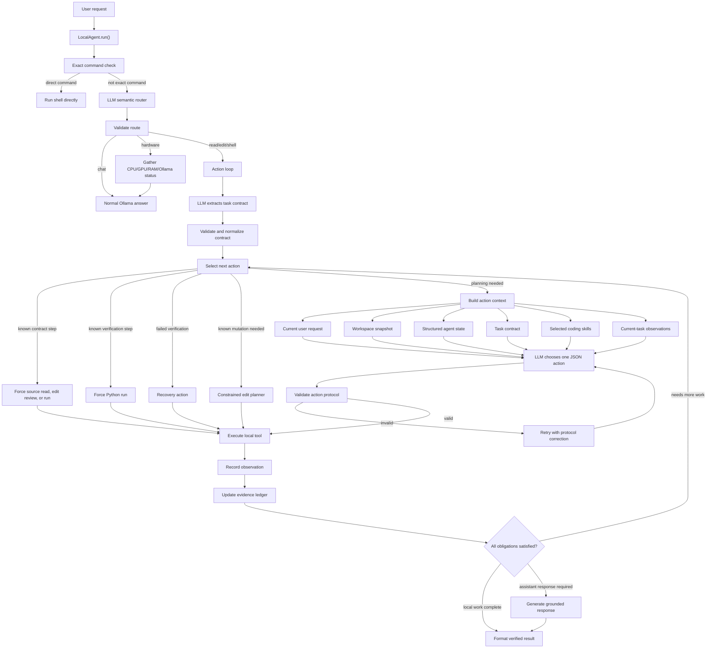

# Agent Architecture

This project is a local-only coding agent built around a small observe-act loop.



## Core Idea

The model decides the next useful step, but the harness decides whether that step is valid and safe.

```text
LLM reasoning
+ deterministic route/action validation
+ workspace-confined local tools
+ task contracts and evidence-ledger finish checks
+ coding workflow skills
+ iterative observation loop
```

The result is a coding assistant that can inspect files, edit code, run local commands, observe failures, and continue toward a verified result without giving the model unrestricted machine access.

## Workflow

1. The user sends a request.
2. `LocalAgent` checks for an exact direct command such as `execute "nvidia-smi"`.
3. Otherwise, the model classifies the request as `chat`, `read`, `edit`, `shell`, or `hardware`.
4. The deterministic harness validates the route and downgrades risky low-confidence action routes to chat.
5. For action routes, the model extracts a task contract from the request, route, workspace snapshot, task spec, structured agent state, and legacy completion requirements.
6. The deterministic harness validates and normalizes the task contract, merging conservative fallback obligations when needed.
7. Before asking the model for another action, the harness checks whether a known contract, verification, mutation, or repair step can be selected deterministically.
8. When model planning is needed, the agent builds a self-contained context packet from the current request, workspace files, structured agent state, selected coding skills, completion requirements, the task contract, and observations from the current task.
9. The model returns exactly one JSON action.
10. The harness validates the action protocol and tool permissions.
11. A local tool runs, and the result is recorded as an observation.
12. The evidence ledger is checked against the task contract and legacy completion criteria.
13. Existing-file updates must pass an isolated semantic edit review that compares the original source, resulting diff, and edited source against the exact request.
14. When local work and a conversational answer were both requested, a separate grounded response call answers from the observed actions after the local obligations are satisfied.
15. The loop continues until the task is complete, verification succeeds, safety blocks the action, repair stalls, or the step limit is reached.

Validation is not just JSON shape checking. The harness also rejects repeated failed command proposals, repeated identical rewrites, missing test directories for unittest discovery, Python script runs that cannot produce requested output, and success claims that lack required task-contract or run/test evidence. If a target has been read and its workspace-change obligation is still missing, planning is constrained to `write_file` or `replace_in_file`.

## Protocol Isolation

Normal chat can use conversation history. Tool planning should not depend on prior assistant prose.

Route and action calls therefore use isolated protocol messages. The protocol prompt explicitly includes:

```text
current user request
workspace snapshot
structured agent state
task contract
completion requirements
selected coding skills
current-task observations
```

Structured state carries compact references such as the last written file and last shell result. This lets the model resolve follow-ups like "test it" while avoiding a common failure mode where a previous successful command result pollutes the next JSON action decision.

## Memory And Context

The project uses two memory paths:

- **Conversation memory** for ordinary chat. Older messages are compacted when the estimated token budget is exceeded.
- **Structured action memory** for tool planning. The current request, agent state, task contract, workspace snapshot, selected skills, and current-task observations are rebuilt for every action call.

The action protocol does not receive the full prior assistant transcript. This prevents stale success messages, code blocks, or command suggestions from becoming accidental instructions for a new task. A single oversized protocol packet is middle-truncated while preserving its protocol/request prefix and latest-evidence suffix, preventing Ollama from blindly discarding critical instructions at the context limit.

If Ollama reports a memory-related request failure, the harness halves `num_ctx` down to `min_num_ctx` and retries. This lets the agent degrade gracefully when less memory is available than expected.

## Task Contracts

The task contract layer is a structured finish gate. It does not replace tool validation or the older run/test/output checks; it adds a more expressive ledger of obligations extracted from the current request.

Current contract obligations include:

```text
workspace_change
workspace_delete
workspace_discovery
source_inspection
source_report
edit_review
local_execution
test_evidence
visible_output
assistant_response
```

The model extracts obligations and ordering constraints in a JSON protocol call. The harness validates the schema, normalizes ids and params, rejects unknown obligation kinds, and merges conservative fallback obligations when the model omits broad run/test/output requirements. Set `contract_mode` to `fallback` to skip model extraction and use only the deterministic fallback contract.

The harness converts tool observations into an evidence ledger: successful changes, deleted files, file reads, semantic edit reviews, discovery actions, successful shell runs, and the step of the latest change. A `finish` or `answer` action can be rejected when the ledger does not support the contract, even if a broad legacy flag such as `requires_run` has already been satisfied.

For an update or repair, the fallback contract adds this lifecycle:

```text
source_inspection -> workspace_change -> edit_review
```

The controller captures the original file before mutation. The isolated edit-review protocol receives the user request, a unified before/after diff, bounded source excerpts, and compact action history. It judges source correctness only; execution, final source display, and result-display duties stay in the evidence ledger. A failed source review forces a fresh read and a focused edit-repair protocol that returns complete corrected file content, then the result is reviewed again.

Execution, test, visible-output, and source-report obligations are only retained when the validated fallback contract shows that the user actually requested that evidence. This prevents the contract model from turning phrases such as "None results" into a mandatory command run or "display command results" into an unnecessary source listing.

This is intentionally still lightweight. It gives the harness a general place to represent task obligations without adding one-off completion booleans for every prompt shape.

### Example Contract

For:

```text
Write update_twice.py, run it, change its marker, run it again, then delete it.
```

The model can produce obligations equivalent to:

```json
{
  "obligations": [
    {"id": "create", "kind": "workspace_change", "params": {"target_path": "update_twice.py"}},
    {"id": "first_run", "kind": "local_execution", "params": {"target_path": "update_twice.py"}},
    {"id": "update", "kind": "workspace_change", "params": {"target_path": "update_twice.py"}},
    {"id": "second_run", "kind": "local_execution", "params": {"target_path": "update_twice.py"}},
    {"id": "cleanup", "kind": "workspace_delete", "params": {"target_path": "update_twice.py"}}
  ],
  "constraints": [
    {"kind": "before", "first": "create", "second": "first_run"},
    {"kind": "before", "first": "first_run", "second": "update"},
    {"kind": "before", "first": "update", "second": "second_run"},
    {"kind": "before", "first": "second_run", "second": "cleanup"}
  ]
}
```

The exact IDs and descriptions may vary. The harness only accepts known obligation kinds and valid `before` constraints, then evaluates them against observed tool steps.

## Action Selection Order

Each loop iteration chooses one action in this order:

1. **Contract-forced action**: perform a known missing source read, semantic edit review, or Python execution when the contract target is concrete. Existing-file changes force a read even if the model contract omitted source inspection.
2. **Verification-forced action**: run a newly written Python file when the request requires execution and the file has suitable tests/output.
3. **Repair recovery**: inspect the latest edited file or choose a corrected run after a failed verification.
4. **Constrained mutation**: when an inspected target still has a missing workspace change, ask the model only for `write_file` or `replace_in_file`.
5. **Model-planned action**: send the isolated action context to the model.

This hybrid design is deliberate. The model handles open-ended planning, while deterministic transitions handle obvious obligations and prevent the model from stopping or wandering when the next step is already known.

## Protocol Layers

The harness uses five separate model protocols:

```text
router protocol   -> classify chat/read/edit/shell/hardware
contract protocol -> extract obligations and ordering constraints
action protocol   -> choose exactly one next tool action
edit review       -> judge the resulting source against the requested transformation
edit repair       -> produce complete corrected source after a failed review
```

Router, contract, action, edit-review, and edit-repair calls request JSON at temperature `0.0`. Invalid protocol output is retried with a correction. Ordinary chat and the final conversational response are not forced into the JSON protocol.

Keeping these protocols separate makes failures diagnosable. A bad route, incomplete contract, malformed action, failed tool execution, and incorrect code generation are different failure classes.

## Tools Versus Skills

Tools are primitive capabilities:

```text
list_files
read_file
search_text
write_file
replace_in_file
delete_file
run_shell
hardware_profile
```

Skills are procedural guidance for using those tools correctly:

```text
coding-change
project-discovery
python-testing
debugging
algorithm-verification
```

For example, `python-testing` does not run tests by itself. It reminds the model to use the correct project-root command for unittest files, while the existing shell tool and safety policy still control execution.

The same separation applies to repair work. `debugging` and `algorithm-verification` tell the model how to interpret failures, while `LocalAgent` decides whether the proposed next action is admissible and whether the loop has enough evidence to finish.

## Python Verification Planning

Python execution is selected from source structure, not only the filename:

- `tests/test_*.py` runs through unittest discovery from `tests`.
- Regular modules containing `unittest.TestCase` classes run through discovery in their containing directory.
- Regular modules with uninvoked top-level `test_*` functions use a small standard-library `runpy` runner that calls those functions and prints a test count.
- Ordinary scripts with visible output run directly with `python3 <file>`.

For test-only edits, AST comparison protects existing implementation functions and classes. If a simple literal-argument assertion fails while implementation changes are forbidden, a narrow deterministic repair can evaluate the assertion against the preserved implementation and correct only its expected literal.

## Completion And Final Responses

Completion is evidence-based:

- Workspace changes require successful `write_file` or `replace_in_file` observations.
- Existing-file updates additionally require a successful post-change `edit_review` observation.
- Deletion requires a successful `delete_file` observation.
- Execution counts require matching successful `run_shell` observations.
- Tests require passing-test evidence.
- Visible output requires observed stdout or stderr.
- Source reporting requires a successful read whose contents are appended to the final response. After an edit, that read must occur after the latest successful change.
- Ordering constraints compare observation step numbers.

When an `assistant_response` obligation exists, local work finishes first. A final model call receives the contract and observed actions, answers the conversational part, and is instructed not to invent local results. The harness then appends contract-supported source evidence and the minimal successful command evidence required by the contract. Explicit "run before, edit, run again" requests retain both ordered results; ordinary edit-run-display tasks report post-edit evidence rather than stale pre-edit runs.

## Safety Boundaries

The model proposes actions but never directly accesses the filesystem or shell.

- Every path is resolved relative to the configured workspace.
- File deletion is limited to individual files inside that workspace.
- Mutating actions require confirmation unless trust is `auto`.
- Network-capable shell commands are blocked by default.
- Destructive shell patterns such as recursive forced removal, `mkfs`, `dd`, and `git reset` are blocked.
- Ollama endpoints are limited to local hosts and the Compose service name.
- The action loop is bounded by `max_steps`.

These controls are deterministic because safety and authorization should not depend on model judgment.
