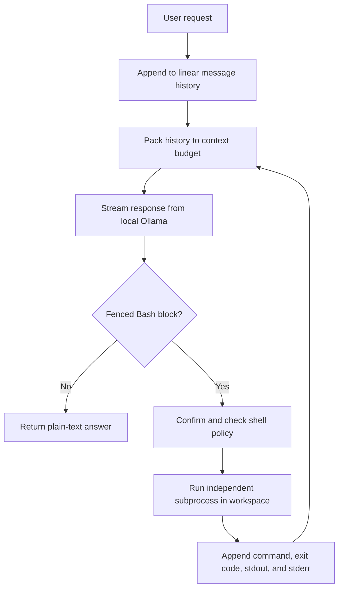

# Architecture

The project intentionally puts model capability ahead of harness complexity.



## 1. Linear History

`LocalAgent` stores the actual interaction sent to the model:

```python
self.messages = [{"role": "system", "content": SYSTEM_PROMPT.format(workspace=config.workspace)}]
self.messages.append({"role": "user", "content": task})
```

There is no separate router state, evidence ledger, or hidden planner transcript. This makes a failure reproducible: the trajectory is the prompt history.

## 2. Model Action Protocol

The model has one action interface:

````text
```bash
command
```
````

`extract_shell_commands()` recognizes fenced Bash blocks. A response without one is a final answer. Bash is enough to inspect files, edit code, search, run tests, and use Git, so custom `read_file`, `write_file`, and `run_tests` schemas are unnecessary.

The system prompt also exposes stable environment facts, such as the availability of `python3`. This is an environment contract, not intent classification.

## 3. Independent Execution

`WorkspaceShell.run()` uses:

```python
subprocess.run(
    command,
    shell=True,
    cwd=self.config.workspace,
    capture_output=True,
    text=True,
    timeout=self.config.shell_timeout,
    executable="/bin/bash",
)
```

Every action starts from the same workspace root. Independent processes avoid hidden shell state and make a future Docker executor easy to substitute.

Before execution, the shell:

- asks for approval unless trust is `auto`
- blocks common network commands unless enabled
- blocks obvious destructive commands
- applies a timeout
- truncates very large output

These controls govern capability. They do not decide what the user intended.

## 4. Observation Loop

The real command result is appended as the next message:

```text
<shell_result>
command: python3 tests.py
exit_code: 1
stderr:
AssertionError
</shell_result>
```

The model then chooses whether to inspect, edit, rerun, or finish. A failed command is evidence for the next reasoning step, not a special hard-coded repair branch.

## 5. Context Window

`prepare_messages()` estimates tokens from text length. When history exceeds `num_ctx - num_predict`, it keeps:

1. the system prompt
2. a notice that older turns were omitted
3. the newest complete messages that fit

This favors recent observations without inventing a lossy model summary. The prompt tells the agent to re-inspect files whenever exact state matters. Repository files are therefore the durable memory; conversation history is working memory.

## 6. Local Model Client

`OllamaClient.chat_stream()` sends `/api/chat` requests only to an approved local endpoint. Streaming records:

- TTFT: request start to first non-empty response chunk
- prompt token count and throughput
- output token count and generation throughput
- total model latency

`AgentResult` adds end-to-end turns, command count, task time, and TFS, the time until the first executable shell action.

## 7. Why No RAG, Skills, Or OpenClaw

RAG is useful when knowledge lives outside the active repository. Here, the model can search the workspace directly with Bash, so an embedding index would duplicate the source of truth and add synchronization problems.

Static skills and intent classes were removed because they constrained a capable model to anticipated prompt shapes. OpenClaw was not needed because the product requires one local model and one local execution environment, not a multi-agent orchestration platform.

The resulting core is about 700 lines across the agent, configuration, context, Ollama client, shell, and CLI. The actual reasoning/execution loop is about 150 lines.

## 8. Known Trade-Off

This architecture exposes model quality clearly. A small model can still write incorrect code, choose inefficient commands, or stop too early. The solution is measured improvement through model choice, prompts, context, and benchmark results, not an expanding collection of prompt-specific controller rules.
