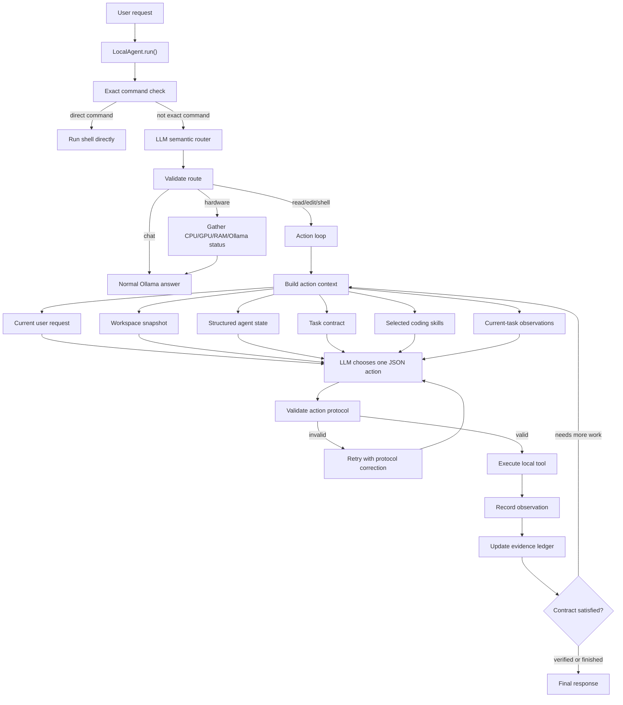

# Agent Architecture

This project is a local-only coding agent built around a small observe-act loop.



## Core Idea

The model decides the next useful step, but the harness decides whether that step is valid and safe.

```text
LLM reasoning
+ deterministic route/action validation
+ workspace-confined local tools
+ task contracts and evidence-ledger finish checks
+ coding workflow skills
+ iterative observation loop
```

The result is a coding assistant that can inspect files, edit code, run local commands, observe failures, and continue toward a verified result without giving the model unrestricted machine access.

## Workflow

1. The user sends a request.
2. `LocalAgent` checks for an exact direct command such as `execute "nvidia-smi"`.
3. Otherwise, the model classifies the request as `chat`, `read`, `edit`, `shell`, or `hardware`.
4. The deterministic harness validates the route and downgrades risky low-confidence action routes to chat.
5. For action routes, the agent infers a task contract from the request, route, task spec, and legacy completion requirements.
6. The agent builds a self-contained context packet from the current request, workspace files, structured agent state, selected coding skills, completion requirements, the task contract, and observations from the current task.
7. The model returns exactly one JSON action.
8. The harness validates the action protocol and tool permissions.
9. A local tool runs, and the result is recorded as an observation.
10. The evidence ledger is checked against the task contract and legacy completion criteria.
11. The loop continues until the task is complete, verification succeeds, safety blocks the action, or the step limit is reached.

Validation is not just JSON shape checking. The harness also rejects repeated failed command proposals, repeated identical rewrites, missing test directories for unittest discovery, Python script runs that cannot produce requested output, and success claims that lack required task-contract or run/test evidence.

## Protocol Isolation

Normal chat can use conversation history. Tool planning should not depend on prior assistant prose.

Route and action calls therefore use isolated protocol messages. The protocol prompt explicitly includes:

```text
current user request
workspace snapshot
structured agent state
task contract
completion requirements
selected coding skills
current-task observations
```

Structured state carries compact references such as the last written file and last shell result. This lets the model resolve follow-ups like "test it" while avoiding a common failure mode where a previous successful command result pollutes the next JSON action decision.

## Task Contracts

The task contract layer is a structured finish gate. It does not replace tool validation or the older run/test/output checks; it adds a more expressive ledger of obligations inferred from the current request.

Current contract obligations include:

```text
workspace_change
workspace_discovery
source_inspection
source_report
local_execution
test_evidence
visible_output
```

The harness converts tool observations into an evidence ledger: successful changes, file reads, discovery actions, successful shell runs, and the step of the latest change. A `finish` or `answer` action can be rejected when the ledger does not support the contract, even if a broad legacy flag such as `requires_run` has already been satisfied.

This is intentionally still lightweight. It gives the harness a general place to represent task obligations without adding one-off completion booleans for every prompt shape.

## Tools Versus Skills

Tools are primitive capabilities:

```text
list_files
read_file
search_text
write_file
replace_in_file
run_shell
hardware_profile
```

Skills are procedural guidance for using those tools correctly:

```text
coding-change
project-discovery
python-testing
debugging
algorithm-verification
```

For example, `python-testing` does not run tests by itself. It reminds the model to use the correct project-root command for unittest files, while the existing shell tool and safety policy still control execution.

The same separation applies to repair work. `debugging` and `algorithm-verification` tell the model how to interpret failures, while `LocalAgent` decides whether the proposed next action is admissible and whether the loop has enough evidence to finish.
