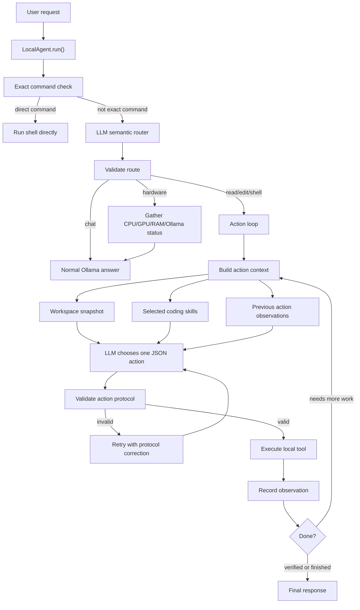

# Agent Architecture

This project is a local-only coding agent built around a small observe-act loop.



## Core Idea

The model decides the next useful step, but the harness decides whether that step is valid and safe.

```text
LLM reasoning
+ deterministic route/action validation
+ workspace-confined local tools
+ coding workflow skills
+ iterative observation loop
```

The result is a coding assistant that can inspect files, edit code, run local commands, observe failures, and continue toward a verified result without giving the model unrestricted machine access.

## Workflow

1. The user sends a request.
2. `LocalAgent` checks for an exact direct command such as `execute "nvidia-smi"`.
3. Otherwise, the model classifies the request as `chat`, `read`, `edit`, `shell`, or `hardware`.
4. The deterministic harness validates the route and downgrades risky low-confidence action routes to chat.
5. For action routes, the agent builds a context packet from workspace files, selected coding skills, and previous observations.
6. The model returns exactly one JSON action.
7. The harness validates the action protocol and tool permissions.
8. A local tool runs, and the result is recorded as an observation.
9. The loop continues until the task is complete, verification succeeds, safety blocks the action, or the step limit is reached.

## Tools Versus Skills

Tools are primitive capabilities:

```text
list_files
read_file
search_text
write_file
replace_in_file
run_shell
hardware_profile
```

Skills are procedural guidance for using those tools correctly:

```text
coding-change
project-discovery
python-testing
debugging
algorithm-verification
```

For example, `python-testing` does not run tests by itself. It reminds the model to use the correct project-root command for unittest files, while the existing shell tool and safety policy still control execution.
